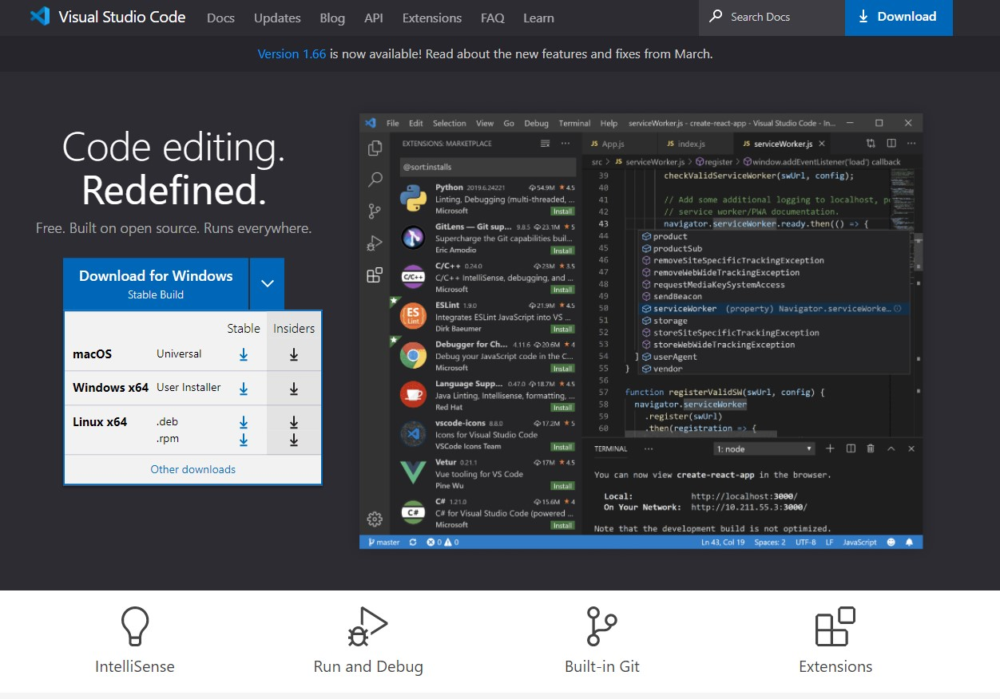
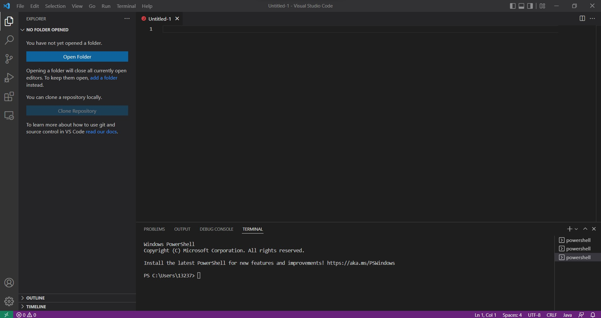
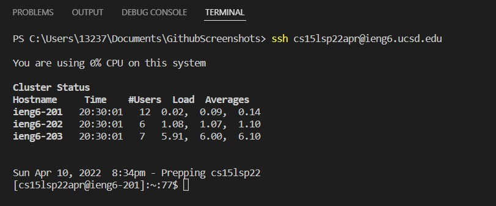
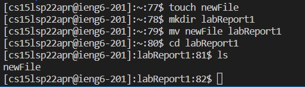
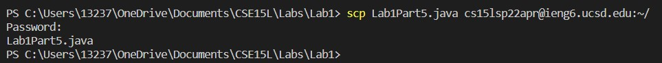
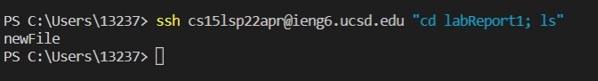

# Lab Report #1

*Edwin Ambrosio*

*April 10 2022*

***

## Installing VS Code
VS Code is the IDE we will be using for this tutorial. The steps to set the program up is as follows:

* The first step would be to go to the
[VS Code Website](https://code.visualstudio.com/)
and click the download button relative to your OS version




* Follow the instructions on your screen and once fully installed, you should be able to open Visual Studio Code on your device

* The screen should look like this:


> *VS Code Windows 10 version*

***

## Remotely Connecting 
We will now remotely connect to an external server, in the case of CSE 15L, this will be the computers in the basement of the CSE building. 

* Download the OpenSSH program found [here](https://docs.microsoft.com/en-us/windows-server/administration/openssh/openssh_install_firstuse) and add the Remote SSH extensions on VS Code

* Go to the account lookup website [here](https://sdacs.ucsd.edu/~icc/index.php) and login to find your course-specific username. 

* Reset your course-specific account password and click the enter key on the last entry-box "Confirm Password" instead of pressing the submit button

* Open a terminal in VS Code and type in:
```
ssh ACCOUNTNAME@ieng6.ucsd.edu
```
> replace ACCOUNTNAME with the course-specific name you found earlier

* Say yes to the prompt to establish connection 

* Type in the new password you made to login and you should see something like this:


> *Will look different for first-time login*
***

## Trying Some Commands
You can now type commands on the client (your pc) that will run on the server (basement computers). Some basic commands are as follows: 

* Create a file using the touch command

* Make a new directory in the main server hub

* Move your file into this new directory

* Change the directory to view your new directory 

* Use the ls command to check if your file has successfully been moved into the directory

```
touch newFile
mkdir labReport1
mv newFile labReport1
cd labReport1
ls
```
> The result to this code should be as follows: 



***

## Moving Files with scp

Moving files from the client to the remote server is possible using the scp command, but there are a few rules to follow!

* You 
**MUST**
be logged out of the remote server from the terminal and run this command through the client.

* If you are logged in, use Ctlr + D or type "exit" to log off

* Follow this format:
```
scp FILE_NAME ACCOUNTNAME@ieng6.ucsd.edu:~/
```
* You can add a path after the ~/ to send the file to a specifc location, but we will use that later.

* Since you have not yet made a SSH key, you will need to input your password to login to the remote server.

An example of the scp command being used to move a .java file is shown below:


***

## Setting an SSH Key
You can setup an SSH Key to allow you to login to your account on the remote server or scp without having to input your password everytime!

* On your client (logged off from the server) input the following command:
```
ssh-keygen
```
* Click enter to save the ssh key into the id_rsa file

* Click enter when prompted for a passsphrase:
**DO NOT ADD A PASSPHRASE**

* Click enter again to confirm the password

* For the following scp command, use the public key. Not the private.
```
scp id_rsa.pub ACCOUNTNAME@ieng6.ucsd.edu:~/ .ssh/authorized_keys
```
* The .ssh/authorized_keys path should already be created in the private CSE basement server. 

Once you've successfully done this, you can now login to the remote server without a password as follows:


***

## Optimizing Remote Running

You can run commands within the same line as the ssh command to save time from logging in and running the lines individually! 

```
ssh ACCOUNTNAME@ieng6.ucsd.edu "cd labReport1; ls"
```
> *The result of this code is as follows:*



This strategy can be used in a number of different situations... experiment!

***